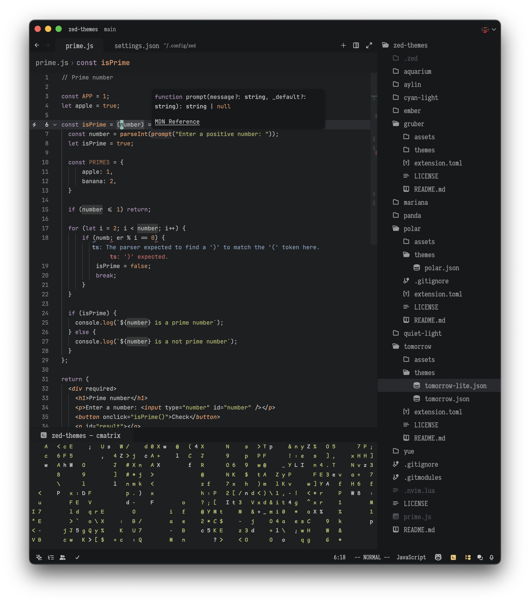
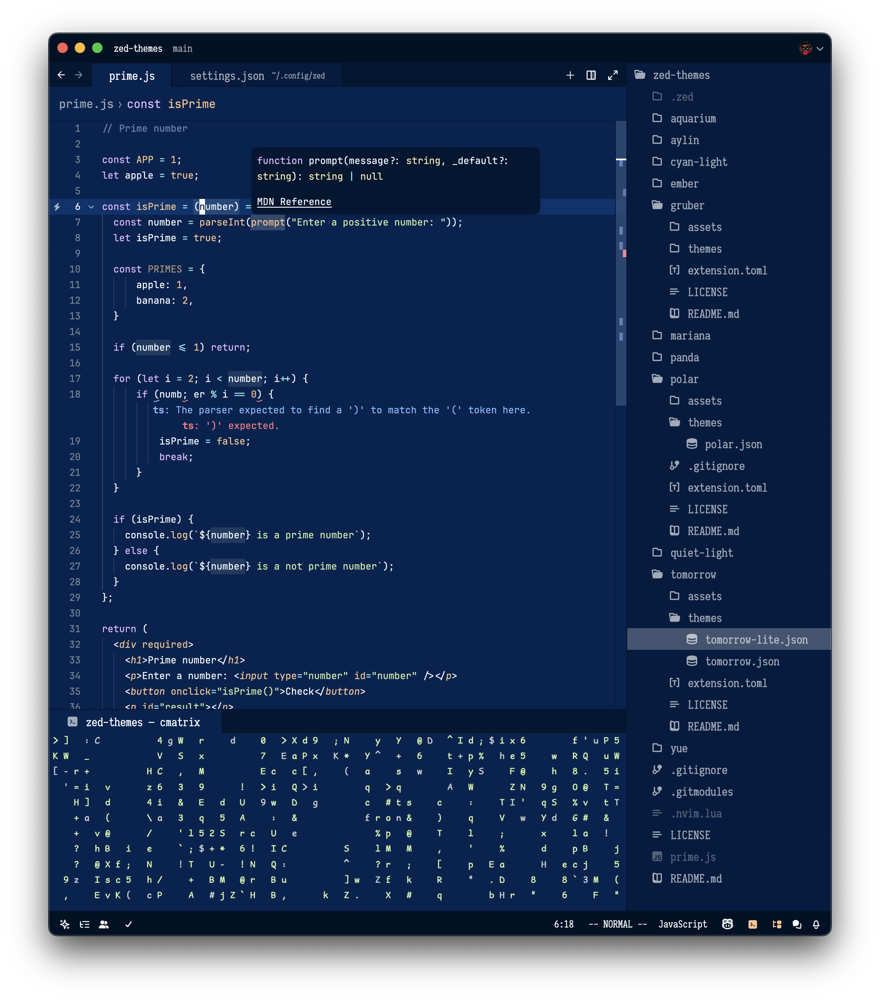
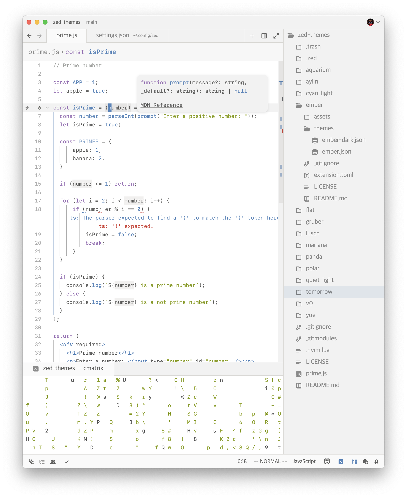
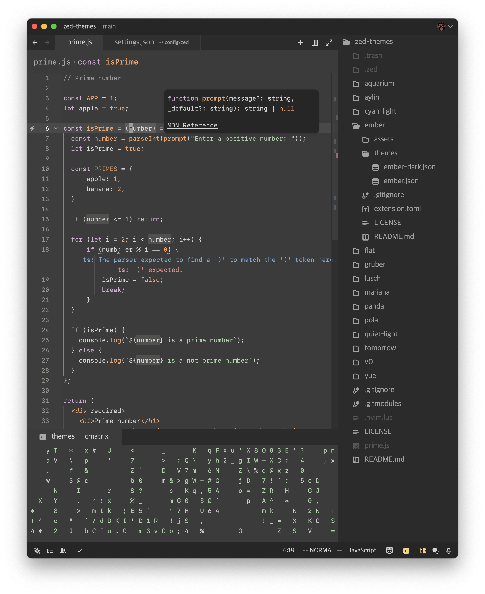
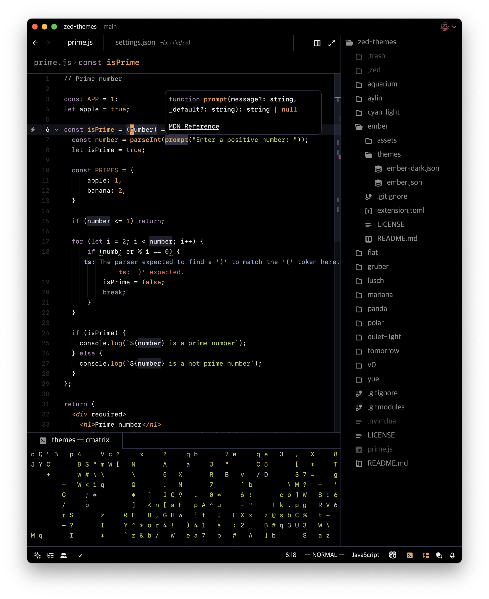

# Tomorrow Minimal
`variants: [Night Min, Night Out Min, Day Min, Night Blue Min, at Midnight Min]`

based on chriskempson's ["Tomorrow Theme"](<https://github.com/chriskempson/tomorrow-theme?tab=readme-ov-file>)  as well as some port/forks: (VSCode's "[Tomorrow Night Blue](<https://arc.net/l/quote/nbuipqzx>)", [mdBook](<https://rust-lang.github.io/mdBook/for_developers/preprocessors.html>)'s "Coal", and [rusty.nvim](<https://github.com/namrabtw/rusty.nvim?tab=readme-ov-file>))
with less highlights

## Preview
### Tomorrow Night Minimal

### Tomorrow Night Blue Minimal

### Tomorrow Minimal

### Tomorrow Night Out Minimal

### Tomorrow at Midnight Minimal

## Installation
1. Copy tomorrow-min.json to ~/.config/zed/themes/
2. Open Zed and navigate to Settings -> Theme -> Tomorrow Min
